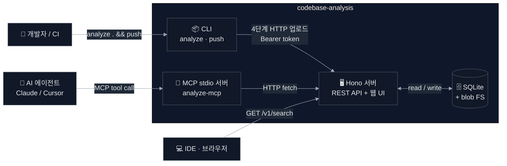

# codebase-analysis

> 사내 코드베이스의 심볼을 색인하고, REST·MCP·웹 UI로 검색·조회할 수 있는 **경량 자체 호스팅 플랫폼**.

3~10명 팀이 별도 SRE 없이 운영할 수 있도록 설계된 MVP. IDE, Claude/Cursor 등 AI 에이전트, CI 파이프라인이 일관된 코드 컨텍스트를 얻도록 한다.

- **심볼 검색**: FTS5 기반 실시간 이름·시그니처 검색
- **소스 본문 조회**: source.zip에서 라인 슬라이스 추출, 별도 체크아웃 불필요
- **MCP 연동**: Claude Desktop/Cursor에서 `search_symbols`, `get_symbol_body` 등 4개 tool 즉시 사용 가능

---

## 5분 Quickstart

```bash
# 1. 레포 클론 후 의존성 설치
git clone <repo-url> && cd codebase-analysis
pnpm install

# 2. 토큰 설정 (.env 파일 생성)
cp docker/.env.example docker/.env
# docker/.env 열어서 ANALYZE_UPLOAD_TOKEN 값을 변경

# 3. 서버 기동
docker compose -f docker/docker-compose.yml up --build -d

# 4. 헬스 체크
curl http://localhost:3000/healthz
# → {"status":"ok"}

# 5. 현재 디렉토리 색인 + 업로드
export ANALYZE_UPLOAD_TOKEN=<위에서 설정한 값>
export ANALYZE_SERVER_URL=http://localhost:3000
pnpm -F @codebase-analysis/cli dev -- analyze .
pnpm -F @codebase-analysis/cli dev -- push

# 6. 검색
curl "http://localhost:3000/v1/search?q=UserService&repo=codebase-analysis"
```

웹 UI: <http://localhost:3000>

> 단계별 상세 설명 → [docs/GETTING-STARTED.md](docs/GETTING-STARTED.md)

---

## 아키텍처 한눈 보기



더 상세한 다이어그램 (컴포넌트·시퀀스) → [docs/OVERVIEW.md](docs/OVERVIEW.md)

---

## 문서 맵

| 문서 | 대상 | 내용 |
|---|---|---|
| [docs/GETTING-STARTED.md](docs/GETTING-STARTED.md) | 초보자 | 설치 → Docker 기동 → 첫 인덱스 → MCP 연결 단계별 가이드 |
| [docs/OVERVIEW.md](docs/OVERVIEW.md) | 팀 리드·리뷰어 | 스펙, 모노레포 구조, mermaid 다이어그램 4종, 데이터 모델 |
| [docs/API.md](docs/API.md) | 통합 개발자 | REST 엔드포인트 전수 + MCP tool 4종 + curl 예시 |
| [docs/LANGUAGES.md](docs/LANGUAGES.md) | 기여자 | 지원 언어 매트릭스 + 새 언어 추가 가이드 |
| [docs/ARCHITECTURE.md](docs/ARCHITECTURE.md) | 개발자 | 상세 패턴 (Storage Adapter, zod 단일 출처, Variant A/B) |
| [docs/ADR.md](docs/ADR.md) | 설계자 | 아키텍처 결정 기록 (ADR-001 ~ ADR-014) |
| [docs/PRD.md](docs/PRD.md) | PM | 제품 목표, 사용자, MVP 성공 지표 |

---

## 지원 언어

| 언어 | 상태 | tree-sitter grammar |
|---|---|---|
| TypeScript | ✅ 지원 | `tree-sitter-typescript@0.21.2` |
| JavaScript | ✅ 지원 | `tree-sitter-javascript@0.21.4` |
| Java | ✅ 지원 | `tree-sitter-java@0.23.5` |
| Kotlin | 🔜 이연 | FT-004 — 추후 신규 작성 예정 |
| Python | ⛔ 미포함 | MVP 범위 밖 |

새 언어 추가 방법 → [docs/LANGUAGES.md](docs/LANGUAGES.md)

---

## MVP 제외 사항

정확 호출 그래프 · 교차 레포 name resolution · 시맨틱(벡터) 검색 · SAST · OIDC/SSO · 실시간 인덱싱은 의도적으로 제외.
→ [docs/PRD.md — MVP 제외](docs/PRD.md) / [docs/FUTURE-TASKS.md](docs/FUTURE-TASKS.md)

---

## 상태

MVP v0.0.1 · 팀 내부용 · 라이선스 미정
