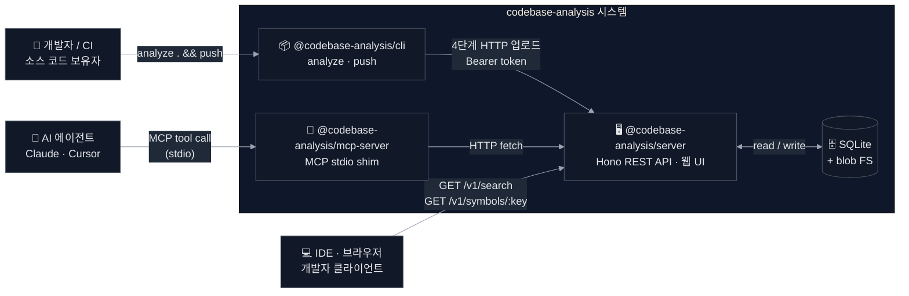
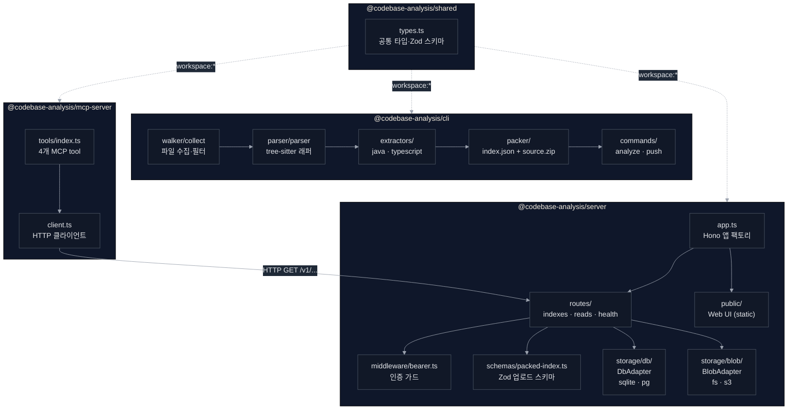
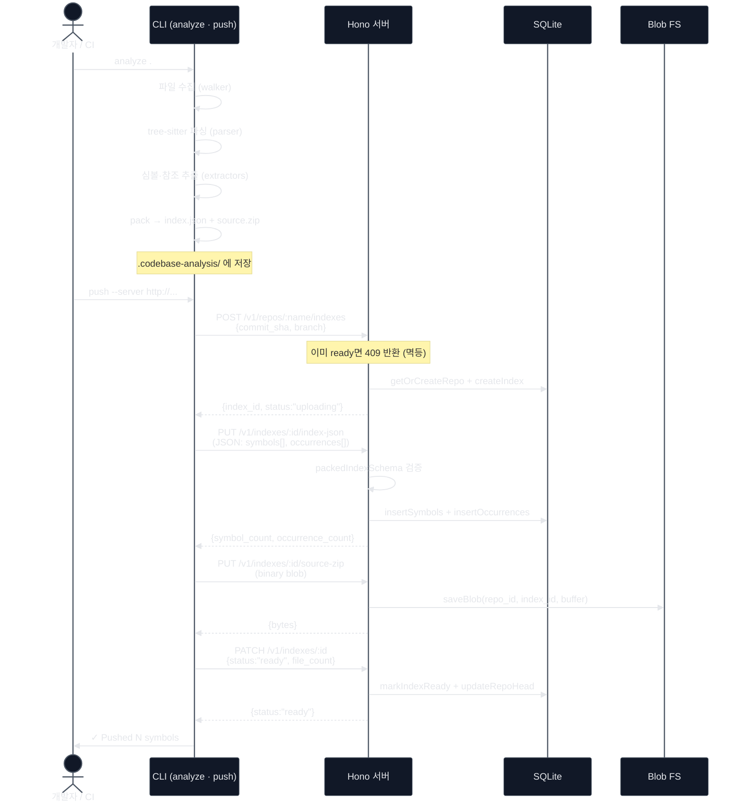
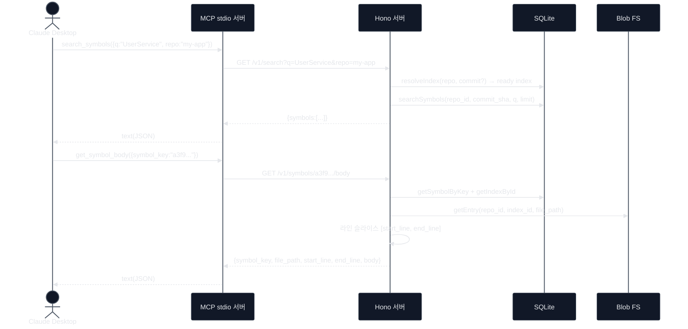

# Overview — 아키텍처·구조 개요

> 팀 리드·리뷰어용. 시각 자료 중심으로 전체 구조를 한 곳에서 파악한다.
> 상세 패턴·의사결정은 [ARCHITECTURE.md](ARCHITECTURE.md) · [ADR.md](ADR.md) 참조.

---

## 프로젝트 스펙

| 항목 | 값 |
|---|---|
| 런타임 | Node.js 22 LTS (ESM, `NodeNext`) |
| 언어 | TypeScript 5.8 (strict) |
| HTTP 프레임워크 | Hono 4 + `@hono/node-server` |
| 유효성 검사 | Zod 3 (REST · MCP · DB 타입 단일 출처) |
| 코드 파싱 | tree-sitter 0.21 |
| 저장소 (Variant A, 기본) | `better-sqlite3` + 로컬 FS |
| 저장소 (Variant B, 선택) | PostgreSQL + S3 (어댑터 패턴으로 교체) |
| 패키지 매니저 | pnpm 10 workspaces |
| 컨테이너 | Docker / docker-compose (단일 서비스) |
| 테스트 | tsx 직접 실행 스모크 테스트 (vitest 미사용) |

**성능 목표 (Variant A)**: 레포 50개 · 합계 50만 심볼까지 p95 검색 latency < 300ms

---

## 모노레포 구조 — 4개 패키지

```
packages/
├── shared/       ✅ 공통 타입·Zod 스키마. 런타임 의존성 없음.
├── cli/          ✅ analyze · push 명령어. tree-sitter로 소스 파싱.
├── server/       ✅ Hono REST API · 정적 웹 UI · SQLite 저장.
└── mcp-server/   ✅ Claude Desktop·Cursor용 MCP stdio 서버.
```

> **상태 배지 규약**: ✅ 구현 완료 | 🔶 스텁/인터페이스만 | 🔜 계획 | ⛔ 범위 밖

패키지 간 의존성은 `workspace:*`로 연결. 외부에 publish하지 않는다.

---

## 다이어그램 1 — 시스템 컨텍스트 (C4-Context)

사용자·외부 시스템과 codebase-analysis 간 관계.



---

## 다이어그램 2 — 컴포넌트 의존 관계

각 패키지 내부 모듈과 패키지 간 의존성.



---

## 다이어그램 3 — 업로드 시퀀스

개발자/CI가 소스 코드를 색인하고 서버에 업로드하는 4단계 흐름.



---

## 다이어그램 4 — 조회 시퀀스

AI 에이전트(Claude Desktop)가 MCP tool을 통해 심볼을 검색하고 본문을 가져오는 흐름.



---

## 핵심 패턴

### Storage Adapter Pattern (ADR-003)

`storage/db/`와 `storage/blob/` 각각 **인터페이스**(`DbAdapter`, `BlobAdapter`)로 정의.  
현재 `server/src/dev.ts`는 Variant A(SQLite + FS)를 직접 선택한다.  
런타임 환경변수 기반 동적 선택은 Variant B 활성화(OQ-004) 시 추가 예정.  
라우트·비즈니스 로직은 인터페이스에만 의존 — 구현 교체 시 라우트 변경 없음.

| 계층 | Variant A (기본) | 상태 | Variant B (선택) | 상태 |
|---|---|---|---|---|
| DB | `storage/db/sqlite.ts` | ✅ 구현 완료 | `storage/db/pg.ts` | 🔶 스텁만 (throw not-implemented) |
| Blob | `storage/blob/fs.ts` | ✅ 구현 완료 | `storage/blob/s3.ts` | 🔶 스텁만 (throw not-implemented) |

### Zod 단일 출처

REST API 요청 검증, MCP tool inputSchema, DB row 타입을 **모두 Zod 스키마 하나에서 파생**.  
`@hono/zod-openapi`로 `/openapi.json` 자동 생성.

### 멱등 업로드 (ADR-010)

`(repo_name, commit_sha)` 조합으로 업로드 단위를 식별. 동일 조합 재업로드 시 `409`를 반환하고 스킵. CI 재실행에도 안전.

### 단일 프로세스 + stateless (ADR-001)

서버는 워커·큐 없이 단일 프로세스. 모든 상태는 SQLite에. 배포 간소화가 목적.

---

## 데이터 모델 요약

| 테이블 | 역할 |
|---|---|
| `repos` | 레포 메타데이터 (name, default_branch) |
| `indexes` | 색인 단위 (repo_id, commit_sha, branch, status, file_count) |
| `symbols` | 심볼 선언 (index_id, symbol_key, name, kind, file_path, start_line, end_line, ...) |
| `occurrences` | 참조 후보 (index_id, caller_key, callee_name, kind, file_path, line) |
| `repo_head` | branch → 최신 index_id 매핑 (commit 해석 규약 ADR-009) |

`symbol_key`는 `(repo_name, commit_sha, file_path, name, kind)`의 SHA-256 hex (64자).

---

## 관련 문서

- [ARCHITECTURE.md](ARCHITECTURE.md) — 상세 패턴·데이터 흐름·codeatlas 이식 정보
- [ADR.md](ADR.md) — 개별 아키텍처 결정 근거 (ADR-001 ~ ADR-014)
- [docs/API.md](API.md) — REST·MCP API 참조
- [docs/LANGUAGES.md](LANGUAGES.md) — 언어 지원 매트릭스·확장 가이드
